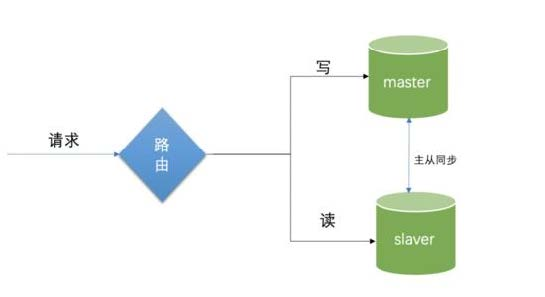
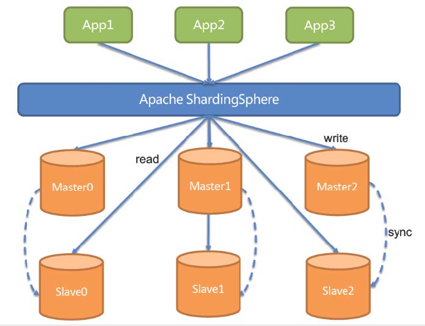

# 读写分离-动态切换数据源

## 读写分离-动态切换数据源版本`1.0`

1. 基于`Spring/Spring Boot`，配置多个数据源(例如2个，`master`和`slave`)
2. 根据具体的`Service`方法是否会操作数据，注入不同的数据源,`1.0`版本
3. 改进一下`1.1`：基于操作`AbstractRoutingDataSource`和自定义注解`ReadOnly`之类的，简化自动切换数据源
4. 改进二下`1.2`：支持配置多个从库；
5. 改进三下`1.3`：支持多个从库的负载均衡。

今天的作业之一。

## 读写分离-数据库框架版本`2.0`

1. 分析前一版本“动态切换数据源”有什么问题？
    1. 侵入性还是较强
    2. 降低侵入性会导致”写完读”不一致问题
2. 改进方式，`ShardingSphere-jdbc`的`Master-Slave`功能
    1. `SQL`解析和事务管理，自动实现读写分离
    2. 解决”写完读”不一致的问题

今天作业之一：使用`ShardingSphere-jdbc 5.0.0-alpha`实现读写分离配置。

## 读写分离-数据库中间件版本3.0
1. 分析前一版本“框架版本”有什么问题？
    1. 对业务系统还是有侵入
    2. 对已存在的旧系统改造不友好
2. 改进方式，`MyCat/ShardingSphere-Proxy`的`Master-Slave`功能
    1. 需要部署一个中间件，规则配置在中间件
    2. 模拟一个`MySQL`服务器，对业务系统无侵入

今天作业之一：使用`ShardingSphere-proxy 5.0.0-alpha`实现读写分离配置。

